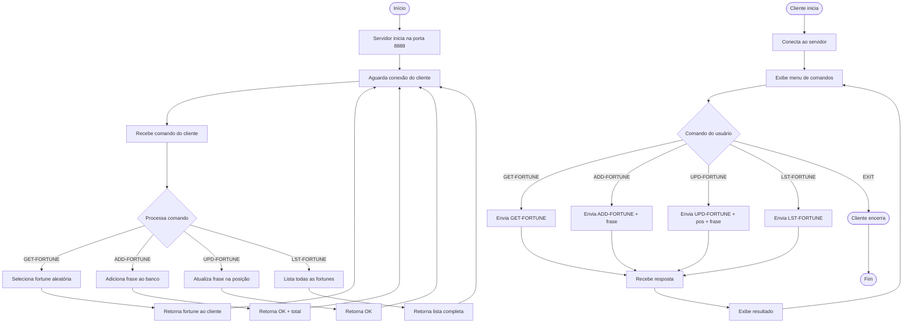

# Exercício 1: Servidor de Fortunes

Este exercício implementa um servidor de fortunes (biscoito da sorte) que permite gerenciar uma base de dados de frases motivacionais.

## Funcionalidades

- **GET-FORTUNE**: Retorna uma frase aleatória do banco de dados
- **ADD-FORTUNE**: Adiciona uma nova frase ao banco
- **UPD-FORTUNE**: Atualiza uma frase existente por posição
- **LST-FORTUNE**: Lista todas as frases armazenadas

## Como Executar

### Servidor

```bash
php servidor.php
```

O servidor iniciará na porta **8888**.

### Cliente

```bash
php cliente.php
```

## Exemplos de Uso

```
> GET-FORTUNE
A persistência é o caminho do êxito.

> ADD-FORTUNE Um sonho se torna realidade quando você começa a trabalhar nele.
OK: Fortune adicionada com sucesso! Total: 8

> LST-FORTUNE
Fortunes armazenadas (8):
[0] A persistência é o caminho do êxito.
[1] O conhecimento é a única riqueza que aumenta quando compartilhada.
[2] Grandes oportunidades nascem de aproveitar bem as pequenas.
...

> UPD-FORTUNE 5 Nova frase aqui
OK: Fortune atualizada na posição 5
```

## Protocolo

As mensagens são enviadas em formato de texto plano, uma por linha:

- `GET-FORTUNE` - Obtém fortune aleatória
- `ADD-FORTUNE <frase>` - Adiciona nova frase
- `UPD-FORTUNE <pos> <frase>` - Atualiza frase na posição
- `LST-FORTUNE` - Lista todas as fortunes

## Diagrama de Atividades



## Arquivos

- `servidor.php` - Servidor que gerencia as fortunes
- `cliente.php` - Cliente interativo para testar o servidor
