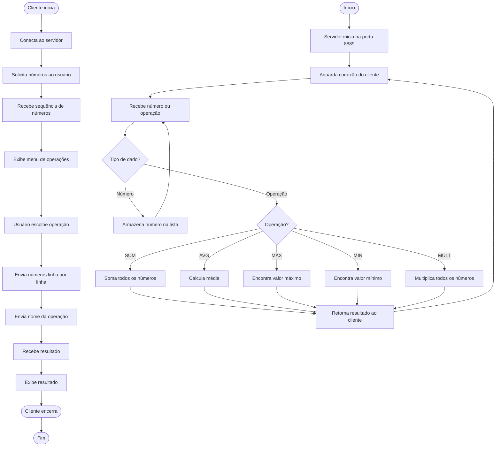

# Exercício 2: Servidor de Sequência de Inteiros

Servidor que aceita uma sequência de números inteiros e retorna o resultado de uma operação matemática.

## Funcionalidades

- Aceita múltiplos números inteiros
- Suporta operações: SUM, AVG, MAX, MIN, MULT
- Detecta fim de sequência através de EOF

## Como Executar

### Servidor

```bash
php servidor.php
```

O servidor iniciará na porta **8889**.

### Cliente

```bash
php cliente.php
```

## Operações Suportadas

- **SUM**: Soma todos os números
- **AVG**: Média aritmética dos números
- **MAX**: Maior valor
- **MIN**: Menor valor
- **MULT**: Multiplicação de todos os números

## Exemplo de Uso

```
Digite os números: 10 20 30 40
Escolha a operação:
  1 - SUM (soma)
  2 - AVG (média)
  3 - MAX (máximo)
  4 - MIN (mínimo)
  5 - MULT (multiplicação)
> 2

Resultado: 25
```

## Protocolo

O cliente envia números linha por linha, terminando com o nome da operação:

```
10
20
30
40
AVG
```

O servidor responde com o resultado da operação.

## Diagrama de Atividades



## Arquivos

- `servidor.php` - Servidor que processa operações matemáticas
- `cliente.php` - Cliente interativo
