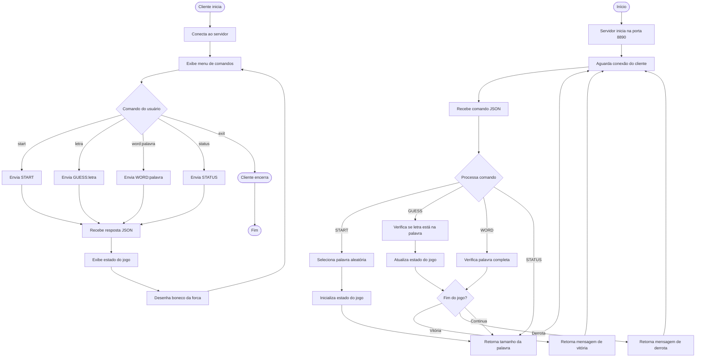

# Exercício 3: Jogo da Forca Remoto

Implementação de um jogo da forca remoto onde o servidor define a palavra e o cliente tenta adivinhar.

## Funcionalidades

- Seleção aleatória de palavras
- Sistema de tentativas com limite de 6 erros
- Visualização do boneco da forca em ASCII
- Comandos JSON para comunicação

## Como Executar

### Servidor

```bash
php servidor.php
```

O servidor iniciará na porta **8890**.

### Cliente

```bash
php cliente.php
```

## Comandos

- `start` - Inicia um novo jogo
- `<letra>` - Chuta uma letra
- `word:<palavra>` - Chuta a palavra completa
- `status` - Ver status do jogo
- `exit` - Sair

## Exemplo de Jogo

```
> start

Tamanho da palavra: 10 letras
Jogo iniciado! Use GUESS:<letra> para chutar uma letra ou WORD:<palavra> para chutar a palavra completa.

Hangman:
  +---+
  |   |
  |
  |
  |
__|__

> a

Palavra: _ _ _ _ _ _ _ _ _ _
Letras tentadas: A
Tentativas: 0/6

> e

Palavra: _ E _ _ _ _ _ _ _ E
Letras tentadas: A, E
Tentativas: 0/6

...

> word:TECNOLOGIA

VITÓRIA! Parabéns! Você ganhou!
```

## Protocolo

Comunicação em JSON:

- `START` - Inicia jogo
- `GUESS:<letra>` - Chuta letra
- `WORD:<palavra>` - Chuta palavra completa
- `STATUS` - Consulta status

## Palavras Disponíveis

PROGRAMACAO, COMPUTADOR, ALGORITMO, SOFTWARE, TECNOLOGIA, BANCO_DADOS, INTERNET, DEVELOPER, LINGUAGEM, FRAMEWORK, APLICATIVO, INTERFACE

## Diagrama de Atividades



## Arquivos

- `servidor.php` - Servidor que gerencia o jogo
- `cliente.php` - Cliente interativo do jogo
