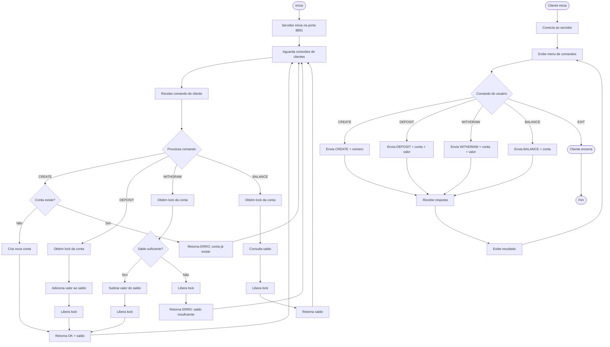

# Exercício 4: Servidor Bancário

Sistema bancário que suporta múltiplos clientes simultâneos com operações de depósito, saque e consulta de saldo.

## Funcionalidades

- Criação de contas
- Depósito de valores
- Saque com verificação de saldo
- Consulta de saldo
- Múltiplos clientes simultâneos
- Sistema de locks para evitar conflitos

## Como Executar

### Servidor

```bash
php servidor.php
```

O servidor iniciará na porta **8891**.

### Cliente (múltiplos terminais)

```bash
php cliente.php
```

Abra múltiplos terminais para simular vários clientes acessando a mesma conta.

## Comandos

- `CREATE <conta>` - Criar nova conta
- `DEPOSIT <conta> <valor>` - Depositar valor
- `WITHDRAW <conta> <valor>` - Sacar valor
- `BALANCE <conta>` - Consultar saldo
- `EXIT` - Sair

## Exemplo de Uso

```
> CREATE 0001
OK: Conta 0001 criada com sucesso. Saldo inicial: R$ 0,00

> DEPOSIT 0001 500
OK: Depósito de R$ 500,00 realizado. Saldo atual: R$ 500,00

> WITHDRAW 0001 200
OK: Saque de R$ 200,00 realizado. Saldo atual: R$ 300,00

> BALANCE 0001
Saldo da conta 0001: R$ 300,00

> WITHDRAW 0001 400
ERRO: Saldo insuficiente. Saldo atual: R$ 300,00
```

## Teste com Múltiplos Clientes

1. Abra o servidor em um terminal
2. Abra múltiplos clientes em terminais diferentes
3. Tente fazer operações na mesma conta simultaneamente
4. O sistema garante a consistência dos dados

## Protocolo

Format: `<COMANDO> <parametros>`

- `CREATE <numero>` - Cria conta
- `DEPOSIT <numero> <valor>` - Deposita
- `WITHDRAW <numero> <valor>` - Saca
- `BALANCE <numero>` - Consulta saldo

## Diagrama de Atividades



## Arquivos

- `servidor.php` - Servidor bancário com gerenciamento de contas
- `cliente.php` - Cliente interativo
