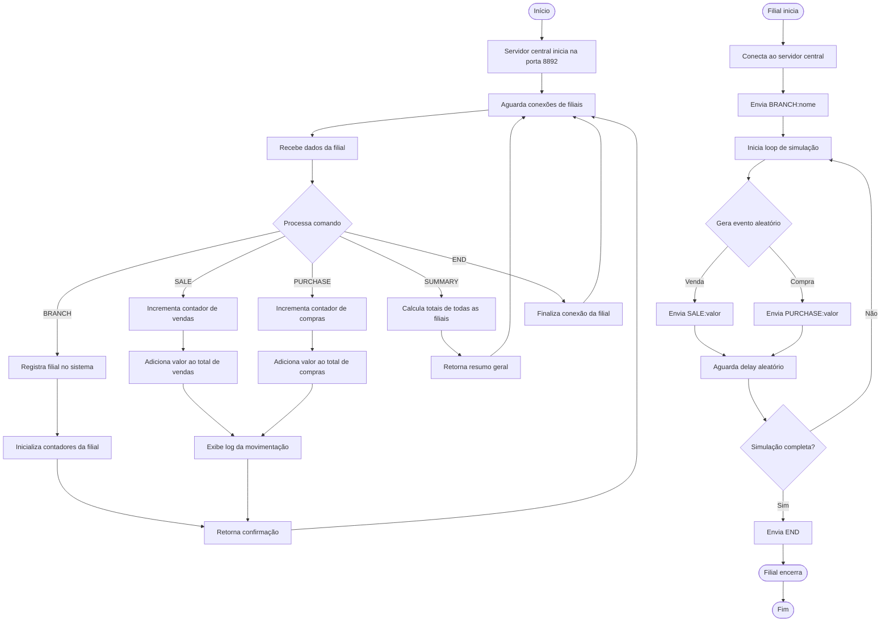

# Exercício 5: Rede de Lojas de Departamento

Sistema central que recebe dados de múltiplas filiais, simulando uma rede de lojas.

## Funcionalidades

- Sistema central que recebe dados de múltiplas filiais
- Registro de vendas e compras por filial
- Agregação de dados de todas as filiais
- Suporte a 5+ filiais simultâneas

## Como Executar

### Servidor Central

```bash
php servidor-central.php
```

O servidor iniciará na porta **8892**.

### Simular uma Filial

```bash
php cliente-filial.php FILIAL01
```

Para simular múltiplas filiais:

```bash
php simular-multiplas-filiais.php
```

## Protocolo

As filiais enviam dados ao servidor central:

- `BRANCH:<nome>` - Registra a filial
- `SALE:<valor>` - Registra uma venda
- `PURCHASE:<valor>` - Registra uma compra
- `SUMMARY` - Solicita resumo geral
- `END` - Finaliza envio de dados

## Simulação

Cada filial simula 1500 ocorrências (vendas e compras) com delays para simular tempo real.

### Executar 5 filiais simultaneamente:

```bash
# Terminal 1 - Servidor
php servidor-central.php

# Terminal 2 - Simulação
php simular-multiplas-filiais.php
```

Ou manualmente:

```bash
php cliente-filial.php FILIAL01 1500 &
php cliente-filial.php FILIAL02 1500 &
php cliente-filial.php FILIAL03 1500 &
php cliente-filial.php FILIAL04 1500 &
php cliente-filial.php FILIAL05 1500 &
```

## Saída Esperada

O servidor exibirá em tempo real as movimentações de cada filial:

```
Filial FILIAL01 registrada
Filial FILIAL01: Venda registrada (1 total)
Filial FILIAL01: Compra registrada (1 total)
Filial FILIAL01: Venda registrada (2 total)
...
```

## Diagrama de Atividades



## Arquivos

- `servidor-central.php` - Sistema central que recebe dados
- `cliente-filial.php` - Simulador de filial
- `simular-multiplas-filiais.php` - Script para iniciar múltiplas filiais
