# Exercício 6: Servidor de Arquivos

Servidor que permite login de usuários e armazenamento de arquivos pessoais.

## Funcionalidades

- Sistema de login com autenticação
- Upload de arquivos
- Download de arquivos
- Listagem de arquivos do usuário
- Armazenamento separado por usuário

## Como Executar

### Servidor

```bash
php servidor.php
```

O servidor iniciará na porta **8893** e criará o diretório `uploads/` automaticamente.

### Cliente

```bash
php cliente.php
```

## Usuários Padrão

- `admin` / `admin123`
- `user1` / `pass123`
- `user2` / `pass456`

## Comandos

Após login:

- `upload <arquivo>` - Fazer upload de arquivo
- `download <nome> <destino>` - Baixar arquivo
- `list` - Listar seus arquivos
- `exit` - Sair

## Exemplo de Uso

```
=== Cliente de Servidor de Arquivos ===
Digite seu usuário: admin
Digite sua senha: admin123

OK: Login realizado com sucesso

> upload exemplo.txt
Enviando exemplo.txt...
OK: Arquivo exemplo.txt enviado com sucesso

> list
Arquivos (admin):
  - exemplo.txt (1,234 bytes)

> download exemplo.txt /tmp/baixado.txt
Baixando exemplo.txt (1234 bytes)...
OK: Arquivo salvo em /tmp/baixado.txt
```

## Estrutura de Armazenamento

```
uploads/
├── admin/
│   ├── arquivo1.txt
│   └── arquivo2.pdf
├── user1/
│   └── docs.txt
└── user2/
    └── relatorio.xlsx
```

## Protocolo

- `LOGIN <usuario> <senha>` - Autenticação
- `UPLOAD <nome> <tamanho>` - Upload (binário)
- `DOWNLOAD <nome>` - Download (binário)
- `LIST` - Listar arquivos

## Diagrama de Atividades

```mermaid
flowchart TD
    Start([Início]) --> Servidor[Servidor inicia na porta 8893]
    Servidor --> CriaDiretorio[Cria diretório uploads/]
    CriaDiretorio --> AguardaConexao[Aguarda conexão do cliente]
    
    ClienteStart([Cliente inicia]) --> Conecta[Conecta ao servidor]
    Conecta --> SolicitaLogin[Solicita usuário e senha]
    SolicitaLogin --> EnviaLogin[Envia LOGIN + usuário + senha]
    
    AguardaConexao --> RecebeLogin[Recebe comando LOGIN]
    RecebeLogin --> VerificaCredenciais{Verifica credenciais}
    
    VerificaCredenciais -->|Válidas| AutenticaUsuario[Autentica usuário]
    VerificaCredenciais -->|Inválidas| RetornaErro[Retorna ERRO: credenciais inválidas]
    
    AutenticaUsuario --> CriaDiretorioUsuario[Cria diretório do usuário se não existir]
    CriaDiretorioUsuario --> RetornaOKLogin[Retorna OK: login realizado]
    RetornaOKLogin --> AguardaComando[Aguarda comandos do cliente]
    
    RetornaErro --> AguardaConexao
    
    EnviaLogin --> RecebeRespostaLogin[Recebe resposta]
    RecebeRespostaLogin --> VerificaLogin{Login OK?}
    
    VerificaLogin -->|Não| SolicitaLogin
    VerificaLogin -->|Sim| MenuComandos[Exibe menu de comandos]
    
    MenuComandos --> Comando{Comando do usuário}
    
    Comando -->|upload| EnviaUpload[Envia UPLOAD + nome + tamanho]
    Comando -->|download| EnviaDownload[Envia DOWNLOAD + nome]
    Comando -->|list| EnviaList[Envia LIST]
    Comando -->|exit| FimCliente([Cliente encerra])
    
    AguardaComando --> RecebeComando[Recebe comando]
    RecebeComando --> Processa{Processa comando}
    
    Processa -->|UPLOAD| RecebeArquivo[Recebe dados binários do arquivo]
    RecebeArquivo --> SalvaArquivo[Salva arquivo no diretório do usuário]
    SalvaArquivo --> RetornaOKUpload[Retorna OK: arquivo enviado]
    
    Processa -->|DOWNLOAD| VerificaArquivo{Arquivo existe?}
    VerificaArquivo -->|Sim| LêArquivo[Lê arquivo do diretório do usuário]
    LêArquivo --> EnviaArquivo[Envia tamanho + dados binários]
    VerificaArquivo -->|Não| RetornaErroArquivo[Retorna ERRO: arquivo não encontrado]
    
    Processa -->|LIST| ListaArquivos[Lista arquivos do diretório do usuário]
    ListaArquivos --> RetornaLista[Retorna lista de arquivos]
    
    RetornaOKUpload --> AguardaComando
    EnviaArquivo --> AguardaComando
    RetornaErroArquivo --> AguardaComando
    RetornaLista --> AguardaComando
    
    EnviaUpload --> RecebeRespostaUpload[Recebe resposta]
    EnviaDownload --> RecebeArquivoCliente[Recebe arquivo]
    EnviaList --> RecebeRespostaList[Recebe lista]
    
    RecebeRespostaUpload --> ExibeResultado[Exibe resultado]
    RecebeArquivoCliente --> SalvaArquivoCliente[Salva arquivo localmente]
    SalvaArquivoCliente --> ExibeResultado
    RecebeRespostaList --> ExibeResultado
    
    ExibeResultado --> MenuComandos
    
    FimCliente --> End([Fim])
```



## Arquivos

- `servidor.php` - Servidor de arquivos
- `cliente.php` - Cliente interativo
- `uploads/` - Diretório criado automaticamente para armazenamento
