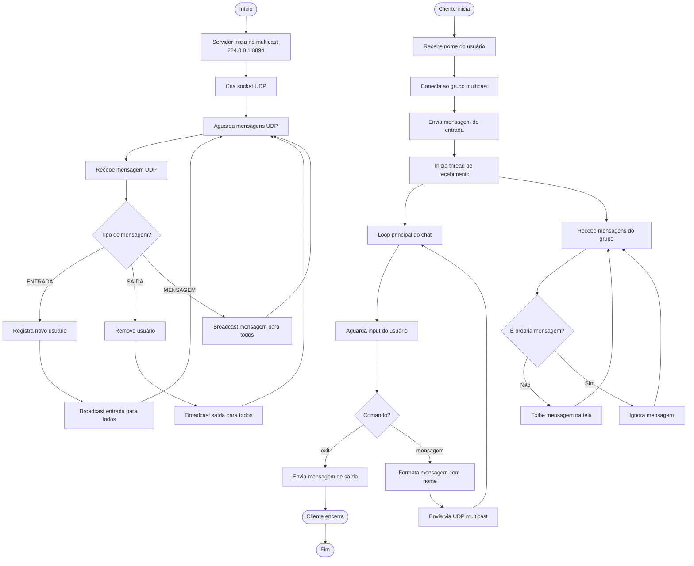

# Exercício 7: Chat UDP

Sistema de chat usando UDP para comunicação em grupo.

## Funcionalidades

- Chat multicast usando UDP
- Múltiplos usuários simultâneos
- Entrada e saída de usuários
- Mensagens em tempo real

## Como Executar

### Servidor

```bash
php servidor.php
```

O servidor iniciará no multicast `224.0.0.1:8894`.

### Cliente (múltiplos)

```bash
php cliente.php Alice
php cliente.php Bob
php cliente.php Charlie
```

## Protocolo

O sistema usa UDP multicast para enviar mensagens a todos os participantes conectados ao grupo.

## Exemplo de Uso

```
=== Chat Multicast ===
Usuário: Alice
Digite 'exit' para sair

>>> Bob entrou no chat
[Bob]: Olá pessoal!
[Alice]: Olá Bob!
>>> Charlie entrou no chat
[Charlie]: E aí pessoal!
>>> Bob saiu do chat
```

## Comandos

- Digite mensagem normalmente - Envia mensagem
- `exit` - Sair do chat

## Características

- **UDP**: Mensagens são enviadas via UDP (protocolo sem conexão)
- **Tempo Real**: Mensagens são entregues imediatamente
- **Notificações**: Usuários são notificados quando alguém entra/sai
- **Múltiplos Participantes**: Suporta vários usuários simultâneos
- **Cross-Platform**: Funciona em Windows e Linux

## Diagrama de Atividades



## Arquivos

- `servidor.php` - Servidor UDP que gerencia mensagens
- `cliente.php` - Cliente de chat

## Observação

Este exercício usa UDP broadcast simples ao invés de multicast puro para garantir compatibilidade cross-platform. O servidor central retransmite mensagens para todos os clientes conectados.
